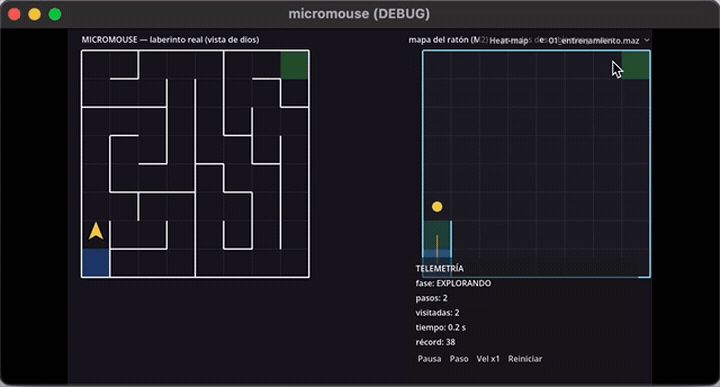

# Micromouse — 2do parcial

Pista B. Es el cerebro de un raton que no conoce el laberinto: lo explora
sensando paredes, se arma su propio mapa con flood fill y al final corre directo
al centro por la mejor ruta que encontro (speed run).

Fork del base: [tabris2015/info_2do_parcial_micromouse](https://github.com/tabris2015/info_2do_parcial_micromouse).
El enunciado esta en [enunciado.md](enunciado.md).

## Demo

Si no carga el gif, esta el video en [docs/demo_training.mp4](docs/demo_training.mp4).

## Como correr

1. Abrir la carpeta en Godot 4.6 y darle Play (F5).
2. La escena es `scenes/game.tscn`.
3. Arranca con mi cerebro (la casilla *Usar Cerebro Estudiante* del nodo Game).
   Si la desmarco corre el wall follower de ejemplo.
4. Para cambiar de laberinto uso el selector de arriba a la derecha (lista solo
   los `.maz` de la carpeta `mazes/`).

Botones: Pausa, Paso (avanza de a uno cuando esta en pausa), Vel x1/x2/x4 y
Reiniciar.

## Que hice

Base:
- B1 telemetria: el hud muestra pasos, visitadas, fase y un cronometro.
- B2 controles: pausa, paso a paso, cambiar velocidad y reiniciar.
- B3 maquina de estados: EXPLORANDO -> VOLVIENDO -> SPEED RUN -> FIN, con
  pantalla final y boton de reiniciar.
- B4 sonidos: paso, choque y la fanfarria de la meta.
- B5: no toque nada del nucleo que ya venia hecho.

Mecanicas:
- M1 flood fill: el cerebro arma su propio mapa solo con lo que sensa y va
  siempre a la celda mas cerca de la meta. Nunca mira el laberinto real, por eso
  funciona en laberintos que no conoce.
- M2 mapa dual: la vista de la derecha dibuja lo que el raton sabe, paredes
  descubiertas y celdas visitadas vs no visitadas, en vivo.
- M3 speed run: despues de explorar vuelve al inicio y corre la mejor ruta sin
  sensar. Se dibujan las dos rutas encimadas y la pantalla final compara pasos.
- M4 selector + records: el selector lee la carpeta `mazes/` sola y el mejor
  speed run de cada lab se guarda en `user://records.json`.

Bonus:
- Heat map de visitas (boton arriba).
- Estela del raton.
- La pantalla tiembla al chocar.
- Particulas en la meta al terminar.

## Recursos que mire

El codigo es mio, pero lei sobre el algoritmo en:
- Micromouse (Wikipedia): <https://en.wikipedia.org/wiki/Micromouse>
- Flood fill (Wikipedia): <https://en.wikipedia.org/wiki/Flood_fill>
- Docs de Godot 4: <https://docs.godotengine.org/en/stable/>

Lo que agregue esta en `cerebro_estudiante.gd`, `game.gd`, `hud.gd`, `vista_mapa.gd`
y `estela.gd`.
